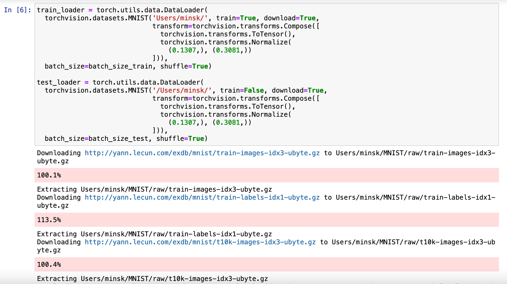

# CNN

## Introduction

### Definition

시각 뉴런 =&gt; 국소적 영역, 단순한 패턴\(단순세포\) + 넓은 영역, 복잡한 패턴\(복잡세포\) = layer

> CNN is a **Deep Learning algorithm** which can take in an input **image**, assign importance \(learnable weights and biases\) to various aspects/objects in the image and be able to differentiate one from the other.

"이미지의 공간 정보를 유지한 상태로 학습이 가능한 모델"

### Properties

* 각 레이어의 입출력 데이터의 형상 유지
* 이미지의 공간 정보를 유지하면서 인접 이미지와의 특징을 효과적으로 인식
* 여러 개의 필터로 이미지의 특징 추출 및 학습
* 추출한 이미지의 특징을 수집/강화: Pooling layer
* 일반 인공 신경망과 비해 학습 파라미터가 적음\(필터를 여러번 적용, 가중치를 공유하기 때문\)

### Terms

* Convolution\(합성곱\): 어떤 함수의 다른 함수에 대한 일치 정도를 Feature Map으로 나타내는 연산
* 채널\(Channel\): convolution에 포함되는 matirces의 depth\(RGB image =&gt; 3\) 필터의 개수와 같다.
* 필터\(Filter\)\(=Kernel\): 일치의 기준이 되는 함수
* 스트라이드\(Strid\): 필터가 이동하는 단위
* 패딩\(Padding\): 이미지의 외곽에 지정된 픽셀만큼  값을 채워 넣는 것
* 피처 맵\(Feature Map\) 또는 액티베이션 맵\(Activation Map\): 합성곱 연산의 결과\(일치 정도\)를 나타낸 map
* 풀링\(Pooling\) 레이어: 출력 데이터를 입력으로 받아서 출력 데이터\(Activation Map\)의 크기를 줄이거나 특정 데이터를 강조하여 나타내는 방법 - Max/Average

## Process of CNN



### Overview

* input image
* Convolutional Neural Network
* Output label \(image class\)

### Steps

* _Convolution_
* _ReLU layer_
* _Pooling_
* _Flatening_
* _Full Connection_

### Step 1-1: Convolution

#### 요소들

* 입력 이미지
* "Feature detector" = 필터
* Feature map

#### 과정

* 이미지의 경계가 되는 왼쪽 위 코너부터 시작해서 필터의 크기에 해당되는 이미지의 부분과 필터의 일치 정도를 곱으로 표현, 그 결과를 feature map의 왼쪽 위 cell에 삽입
* Stride만큼 이동, 같은 연산을 하여 feature map의 cell에 값을 삽입; 반복
* 한 행에 대해 연산이 끝나면 다음 행으로 이동하여 반복


### Step 1-2: ReLU\(**Rectified Linear Unit**\) layer

이미지의 비선형성을 추가하기 위해 사용하는 활성화 함수 중 하나로, ReLU, Leaky ReLU, Randomized Leaky ReLU의 세 종류가 있음.

#### ReLU


* 0 이하의 값이 들어오면 활성화 값을 0으로, 그 이상의 값은 _그대로 전달,_ 따라서 sigmoid function에 비해 계산 속도가 매우 빨라짐.
* **dying neuron**: 손실이 커져 가중치, 편차\(weight, bias\)가 음의 값이 되면 어떠한 입력에도 활성화 값이 0이 되기 때문에,  neuron의 업데이트가 멈춤
* 학습속도가 빠름\(기울기가 1이라서?\)

#### Leaky ReLU


위의 dying neuron 문제를 해결하기 위해 0 이하인 입력에 대해 입력값에 a를 곱한 값\(일반적으로 0.01로 설정한다고 함\)을 출력으로 내보냄.

#### Randomized leaky ReLU

leaky ReLU의 a값을 임의로 지정하여 출력을 내보내는 ReLU

### Step 2: Pooling

* Average pooling
* Max pooling
* ~~Sum pooling~~

#### Max Pooling

> The purpose of max pooling is enabling the convolutional neural network to detect the given image when presented with the image in any manner.

이미지의 구간에서 maximum value를 찾아 pooled feature map에 삽입, "가장 강한 자극만 남기고 나머지 무시, 가장 비슷한 부분을 전달하는 방식"


#### Average Pooling

feature map에서 각각의 patch의 average 값을 계산, 이를 pooled featured map에 삽입하는 방식. 


### Step 3: Flattening


Pooled feature map을 column vector 형태로 'flatten'하는 과정. Feature Map의 값을 이후에 ANN의 input layer에 삽입해줘야 하기 때문에, 그 과정을 용이하게 하기 위함.

### Step 4: Full Connection


세 개의 계층:

* Input layer
* _Fully-connected layer_ \(ANN에서 'hidden layer'와 대응\)
* Output layer

1\) Input layer

Flattening 과정으로 얻은 column vector의 element 각각이 input으로 들어감. Step 1-4를 거쳐 얻은 값들이기 때문에, 각각의 element는 "충분한 accuracy"가 있다고 가정한다.

2\) Fully-connected layer ~ Output layer



직관적으로 과정을 설명하면 다음과 같다.

* fully-connected layer의 neuron이 이미지에 있는 특정한 feature을 탐지\(_detect_\)한다; 가령 개와 고양이 사진을 분류할 때, '코'에 해당하는 부분
* 합성곱 연산으로 나온 값을 바탕으로 개/고양이의 값과 비교한다.
* Output layer에 전달, 이미지를 분류. 

즉 합성곱 연산 + ANN 기반으로 동작함.

### Summary

* We start off with an input image. 
* We apply filters or feature maps to the image, which gives us a convolutional layer. 
* We then break up the linearity of that image using the rectifier function. 
* The image becomes ready for the pooling step, the purpose of which is providing our convolutional neural network with the faculty of “spatial invariance” which you'll see explained in more detail in the pooling tutorial. 
* After we're done with pooling, we end up with a pooled feature map. 
* We then flatten our pooled feature map before inserting into an artificial neural network.

## MNIST Handwritten Digit Dataset

### MNIST Handwritten Digit Dataset



0~9까지의 숫자를 손글씨 데이터셋. 60,000개의 28\*28 pixel의 grayscale 이미지를 training set, 10,000를 test set으로 분류한다. 

### Preparing Dataset

```python
import torch
import torchvision
```

```python
n_epochs = 3
batch_size_train = 64
batch_size_test = 1000
learning_rate = 0.01
momentum = 0.5
log_interval = 10

random_seed = 1
torch.backends.cudnn.enabled = False
torch.manual_seed(random_seed)
```

* `torchvision`: datasets, model architecture, 이미지 전처리 도구 등이 있는 package
* epochs: training 반복 횟수
* `learning_rate`, `momentum`: hyperparameters
* line 8, 10: 정확도를 올려주는 일종의 장치? 난수 생성
* `torch.backends.cudnn.enabled`: cuDNN\(cuda의 딥러닝 라이브러리\)을 disable해줌 
* `batch_size`: 일괄적으로 데이터를 처리해주기 때문에 training/test set에 대해 이러한 변수 이름을 설정해 줌. 여기서는 training set을 64, test set을 1000으로 설정함.

```python
train_loader = torch.utils.data.DataLoader(
  torchvision.datasets.MNIST('/Users/minsk/', train=True, download=True,
                             transform=torchvision.transforms.Compose([
                               torchvision.transforms.ToTensor(),
                               torchvision.transforms.Normalize(
                                 (0.1307,), (0.3081,))
                             ])),
  batch_size=batch_size_train, shuffle=True)

test_loader = torch.utils.data.DataLoader(
  torchvision.datasets.MNIST('/Users/minsk/', train=False, download=True,
                             transform=torchvision.transforms.Compose([
                               torchvision.transforms.ToTensor(),
                               torchvision.transforms.Normalize(
                                 (0.1307,), (0.3081,))
                             ])),
  batch_size=batch_size_test, shuffle=True)
```

* `DataLoader`: datasets, batch size, shuffle 을 argument로 함. 학습을 위한 방대한 데이터를 미니배치 단위로 처리할 수 있고, 데이터를 무작위로 섞음으로써 학습의 효율성을 향상시킬 수 있다는 장점이 있음.



```python
examples = enumerate(test_loader)
batch_idx, (example_data, example_targets) = next(examples)

example_data.shape #torch.Size([1000, 1, 28, 28])
```

```python
import matplotlib.pyplot as plt

fig = plt.figure()
for i in range(6):
  plt.subplot(2,3,i+1)
  plt.tight_layout()
  plt.imshow(example_data[i][0], cmap='gray', interpolation='none')
  plt.title("Ground Truth: {}".format(example_targets[i]))
  plt.xticks([])
  plt.yticks([])
fig
```


## MNIST Datasets Recognition using PyTorch & CNN

### Building NN

```python
import torch.nn as nn
import torch.nn.functional as F
import torch.optim as optim
```

```python
class Net(nn.Module):
    def __init__(self):
        super(Net, self).__init__()
        self.conv1 = nn.Conv2d(1, 10, kernel_size=5)
        self.conv2 = nn.Conv2d(10, 20, kernel_size=5)
        self.conv2_drop = nn.Dropout2d()
        self.fc1 = nn.Linear(320, 50)
        self.fc2 = nn.Linear(50, 10)

    def forward(self, x):
        x = F.relu(F.max_pool2d(self.conv1(x), 2))
        x = F.relu(F.max_pool2d(self.conv2_drop(self.conv2(x)), 2))
        x = x.view(-1, 320)
        x = F.relu(self.fc1(x))
        x = F.dropout(x, training=self.training)
        x = self.fc2(x)
        return F.log_softmax(x)
```


