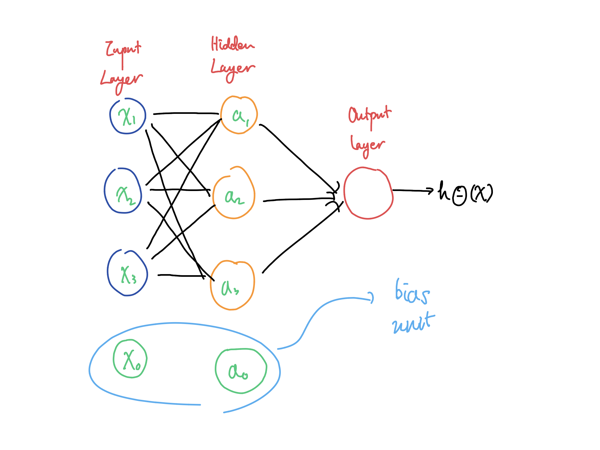

# Neural Network

## Component of NN

* Input layer
* Hidden layer
* Output layer

Above Neural net is denoted by the equation below.

$$
y^* = w_4(\sigma(w_3(\sigma(w_2(\sigma(w_1\times x + b_1)+b_2))+b_3))+b_4
$$

* _σ_: activation function, e.g. _sigmoid function, ReLu,_ etc.
* _w_: weight
* _b_: bias term/unit
* _y\*_: prediction value; we put \* to differentiate it from expected value _y_


**Q. Why do we have a bias term?**

> In other words, we can say output = w · input + w\_b, where w\_b is our constant term c. When we use neural networks, though, or do any multi-variable learning, our computations will be done through Linear Algebra and matrix arithmetic eg. dot-product, multiplication. This can also be seen graphically in the ANN. There should be a matching number of weights and activities for a weighted sum to occur. Because of this, we need to “add” an extra input term so that we can add a constant term with it. Since, one multiplied by any value is that value, we just “insert” an extra value of 1 at every layer. This is called the bias unit.

**“shifts”** the activation function to the left or to the right


## Propagation

part of ANN training: FP - prediction, BP - optimization

### Forward Propagation



Process of evaluating y\* \(prediction\). As the name suggests, the input data is fed in the forward direction through the network. Each hidden layer accepts the input data, processes it as per the activation function and passes to the successive layer.

At each neuron in a hidden or output layer, the processing happens in two steps:

1. **Preactivation:** it is a _weighted sum of inputs_ i.e. the _linear transformation of weights_ w.r.t to inputs available. Based on this _aggregated sum_ and _activation function_ the neuron makes a decision whether to pass this information further or not.
2. **Activation:** the calculated weighted sum of inputs is passed to the activation function. An activation function is a mathematical function which adds non-linearity to the network. There are four commonly used and popular activation functions — sigmoid, hyperbolic tangent\(tanh\), ReLU and Softmax.

앞에 y\*을 구하는 과정이 전파\(forward propagation\)

### Backpropagation

Cost function의 partial derivative를 구하는 알고리즘

> The expression tells us how quickly the cost changes when we change the weights and biases.

#### loss

아래는 손실을 구하는 과정, w\_2는 chain rule을 사용하여 구함 

$$
\text{loss} = y^{*} - y = w_3 \times \text{sig}(w_2 \times \text{sig}(w_1 \times x + b_1) + b_2) + b_3 - y  \\ \frac{\partial \text{loss}}{\partial w_3} = \text{sig}(w_2 \times \text{sig}(w_1 \times x + b_1) + b_2) \\ \frac{\partial \text{loss}}{\partial b_3} = 1 \\ \text{Let } w_2 \times \text{sig}(w_1 \times x+ b_1) + b_2 = h_{2\_ in} \\ \frac{\partial \text{loss}}{\partial w_2} = w_3 \times \text{sig}( h_{2\_ in}) \times \text{sig}(w_1 \times x + b_1)
$$



## Implementation of NN Model

위의 모든 과정을 하나의 함수로 처리하기: `loss.backward()` 

